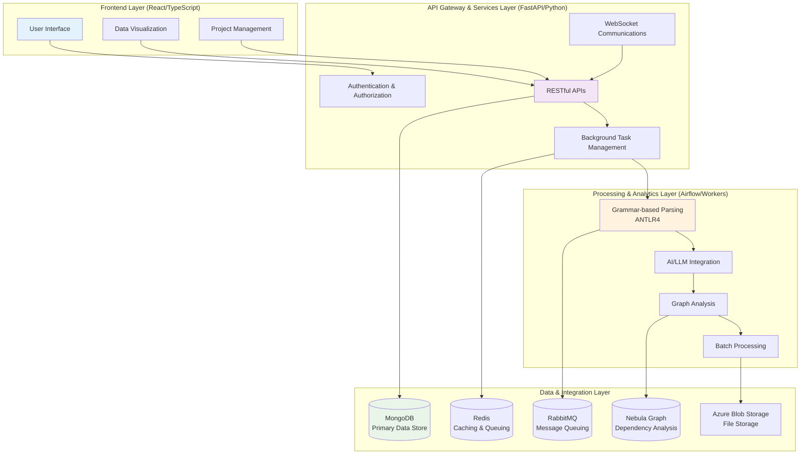
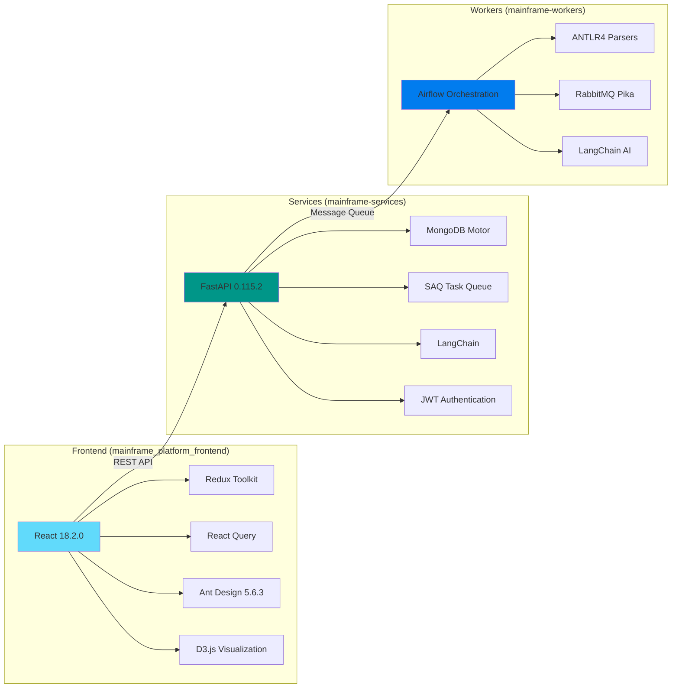
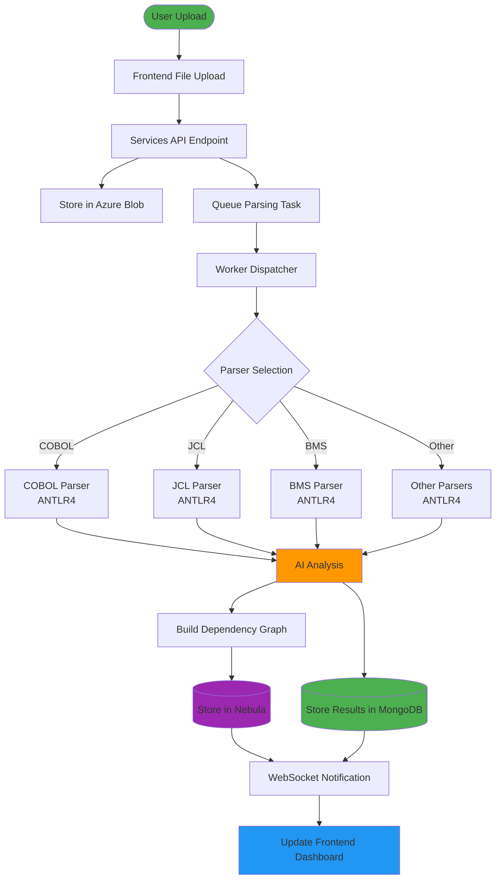
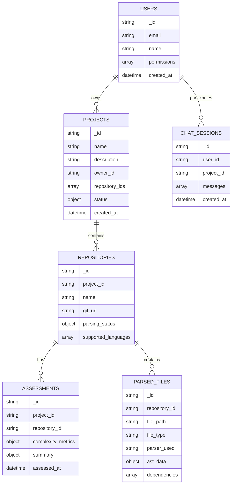
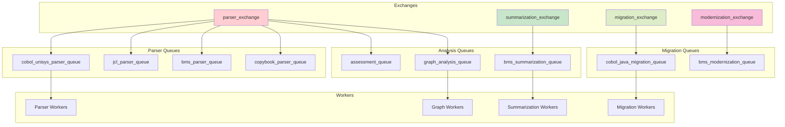
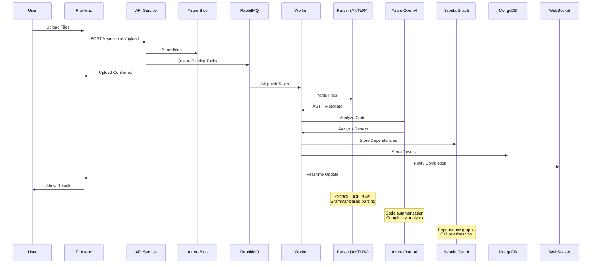
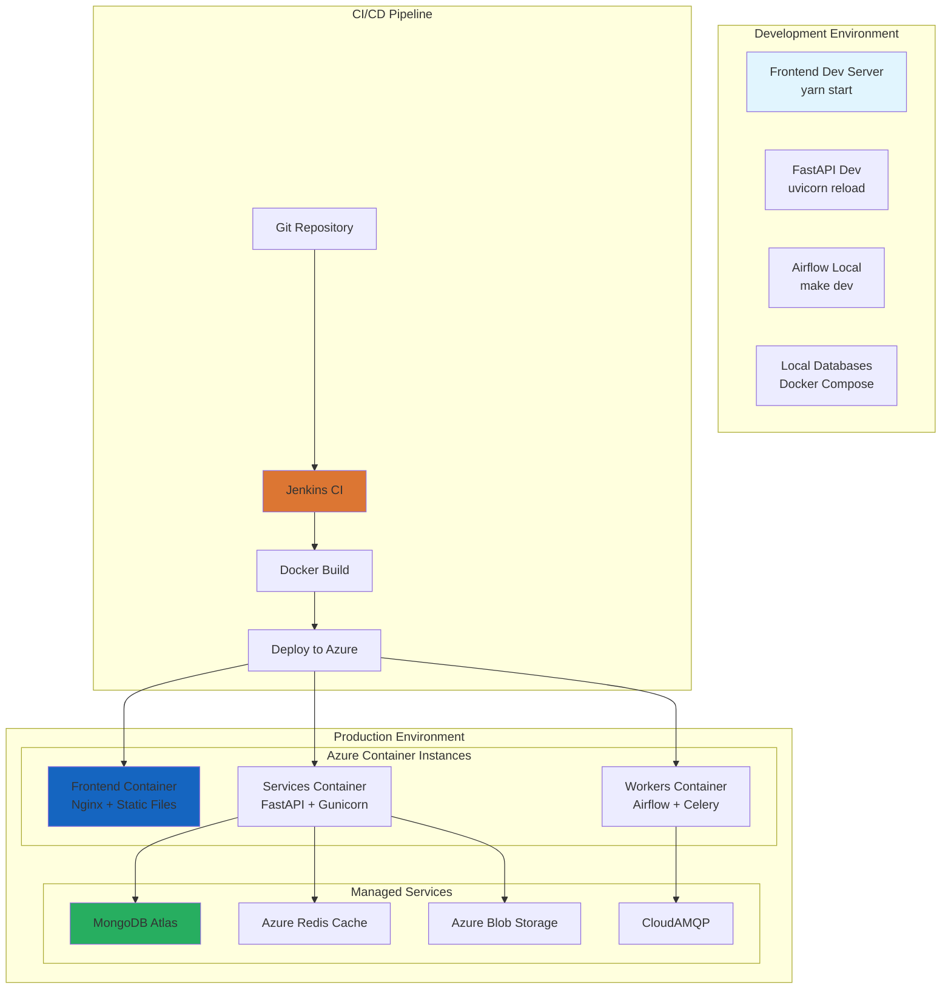

# Mainframe Modernization Platform - Brownfield Architecture

## Executive Summary

The Mainframe Modernization Platform is a comprehensive, microservices-based system designed to analyze, assess, and modernize legacy mainframe applications. This brownfield architecture documentation captures the current state of a production-ready platform that processes multiple mainframe languages (COBOL, JCL, BMS, CLIST, etc.) using advanced parsing, AI-powered analysis, and modern web technologies.

## 1. System Overview

### 1.1 Business Context
- **Domain**: Legacy mainframe modernization and analysis
- **Primary Purpose**: Parse, analyze, assess complexity, and facilitate migration of mainframe codebases
- **Key Capabilities**: 
  - Multi-language parser support (COBOL variants, JCL, BMS, CLIST, WFL, etc.)
  - AI-powered code summarization and migration assistance
  - Dependency graph analysis and visualization
  - Project management and assessment workflows

### 1.2 High-Level Architecture



## 2. Component Architecture



### 2.1 Frontend Layer (`mainframe_platform_frontend/`)

**Technology Stack:**
- **Framework**: React 18.2.0 with TypeScript
- **State Management**: Redux Toolkit + React Query
- **UI Library**: Ant Design 5.6.3
- **Visualization**: D3.js, Chart.js, XYFlow React
- **Build Tools**: CRACO, Webpack

**Key Features:**
- Multi-language support (i18n)
- Real-time data visualization
- Flow chart-based dependency visualization
- WebSocket integration for live updates
- Responsive design with custom theming

**Core Components:**
```typescript
src/
├── components/          # Reusable UI components
├── pages/              # Application screens
├── services/           # API integration layer
├── store/              # Redux state management
├── utils/              # Helper functions
├── types/              # TypeScript definitions
└── hooks/              # Custom React hooks
```

### 2.2 Services Layer (`mainframe-services/`)

**Technology Stack:**
- **Framework**: FastAPI 0.115.2
- **Runtime**: Python 3.10+
- **Database**: MongoDB with Motor (async driver)
- **Authentication**: JWT with python-jose
- **Task Queue**: SAQ with Redis backend
- **AI Integration**: LangChain + Azure OpenAI

**Microservices Architecture:**
```python
API Endpoints:
├── /auth              # Authentication & authorization
├── /users             # User management
├── /projects          # Project lifecycle management
├── /repositories      # Code repository handling
├── /assessments       # Complexity assessments
├── /reverse           # Reverse engineering
├── /chat              # AI-powered assistance
├── /summarization     # Code summarization
├── /migration         # Migration assistance
├── /deadcode          # Dead code detection
├── /duplicate-files   # Duplicate analysis
├── /datasets          # Dataset management
└── /utilities         # System utilities
```

**Key Services:**
- **Authentication Service**: JWT-based with role-based permissions
- **Project Management**: Repository ingestion and project tracking
- **Assessment Engine**: Complexity analysis and scoring
- **Chat Service**: LLM-powered conversational assistance
- **WebSocket Manager**: Real-time communication

### 2.3 Workers Layer (`mainframe-workers/`)

**Technology Stack:**
- **Orchestration**: Apache Airflow
- **Runtime**: Python 3.12+
- **Parser Engine**: ANTLR4 with custom grammars
- **Message Queue**: RabbitMQ with Pika
- **AI Processing**: LangChain + Azure OpenAI

**Parser Support Matrix:**

```mermaid
graph TB
    subgraph "COBOL Variants"
        IBM[IBM COBOL<br/>Cobol85.g4]
        UNISYS[Unisys COBOL<br/>CobolUnisys.g4]
        DNP[DNP COBOL<br/>DNP.g4]
        ISUZU[Isuzu COBOL<br/>CobolIsuzu.g4]
    end
    
    subgraph "Mainframe Languages"
        JCL[JCL<br/>IBM_JCL.g4]
        BMS[BMS<br/>BMS.g4]
        CLIST[CLIST<br/>Clist.g4]
        PANEL[Panel<br/>Panel.g4]
        WFL[WFL<br/>WFL.g4]
        LDLP[LDLP<br/>LDLP.g4]
    end
    
    subgraph "Supporting Formats"
        COPY[Copybooks<br/>CopyBook.g4]
        BATCH[Batch Scripts<br/>Batch.g4]
        OGL[OGL<br/>OGL.g4]
    end
    
    DISPATCHER[Parser Dispatcher] --> IBM
    DISPATCHER --> UNISYS
    DISPATCHER --> DNP
    DISPATCHER --> ISUZU
    DISPATCHER --> JCL
    DISPATCHER --> BMS
    DISPATCHER --> CLIST
    DISPATCHER --> PANEL
    DISPATCHER --> WFL
    DISPATCHER --> LDLP
    DISPATCHER --> COPY
    DISPATCHER --> BATCH
    DISPATCHER --> OGL
    
    style DISPATCHER fill:#ff6b6b
    style IBM fill:#4ecdc4
    style JCL fill:#45b7d1
    style COPY fill:#96ceb4
```



**Processing Pipeline:**



## 3. Data Architecture

### 3.1 Primary Data Stores

**MongoDB Collections:**
```javascript
Database: cobol_analyzer / mainframe_db
Collections:
├── users              # User profiles and permissions
├── projects           # Project metadata and status
├── repositories       # Repository information
├── assessments        # Assessment results and metrics
├── complexity_metrics # Complexity analysis data
├── parsed_files       # Parsed file metadata
├── dependencies       # Code dependencies
├── migration_results  # Migration artifacts
└── chat_sessions      # AI chat history
```

**Data Relationships:**



**Nebula Graph Schema:**
```cypher
// Vertex Types
(:File {name, type, path, project_id})
(:Function {name, file_id, complexity})
(:Variable {name, type, scope})
(:Program {name, type, entry_point})

// Edge Types
-[:CALLS]->        # Function/program calls
-[:INCLUDES]->     # File includes/copies
-[:DEPENDS_ON]->   # Data dependencies  
-[:REFERENCES]->   # Variable references
```

### 3.2 Caching & Queuing

**Redis Usage:**
- Session management
- Task result caching
- Real-time data caching
- SAQ job queue backend

**RabbitMQ Exchanges & Queues:**



## 4. Integration Patterns

### 4.1 External System Integration

**Azure Services:**
- **Azure Blob Storage**: Source code and artifact storage
- **Azure OpenAI**: LLM services for code analysis and migration
- **Azure Active Directory**: Enterprise authentication (configurable)

**Third-party Tools:**
- **Git Integration**: Repository cloning and management
- **Koopa Parser**: Additional COBOL parsing capabilities
- **Docker**: Containerized deployment

### 4.2 Communication Patterns

**Synchronous Communication:**
- REST APIs between Frontend ↔ Services
- WebSocket connections for real-time updates
- Direct database queries within services

**Asynchronous Communication:**
- RabbitMQ for worker task distribution
- Redis pub/sub for cache invalidation
- Airflow DAGs for batch processing workflows

**Data Flow Patterns:**



## 5. Security Architecture

### 5.1 Authentication & Authorization

**Multi-layer Security:**
```python
Security Layers:
├── JWT Token Authentication
│   ├── Access tokens (30min expiry)
│   ├── Refresh token rotation
│   └── Role-based permissions
├── API Gateway Protection
│   ├── Rate limiting
│   ├── CORS configuration
│   └── Request validation
└── Data Layer Security
    ├── MongoDB authentication
    ├── Redis password protection
    └── Azure service authentication
```

### 5.2 Data Protection

**Encryption & Privacy:**
- TLS 1.3 for all communications
- At-rest encryption in Azure Blob Storage
- MongoDB connection encryption
- Sensitive configuration via environment variables

## 6. Scalability & Performance

### 6.1 Horizontal Scaling

**Scalable Components:**
```yaml
Services:
  mainframe_services:
    replicas: configurable
    load_balancing: round_robin
    
Workers:
  parser_workers:
    replicas: auto-scale based on queue depth
    resource_limits: memory/cpu bound
    
Frontend:
  static_hosting: Azure CDN
  caching: aggressive browser caching
```

### 6.2 Performance Optimizations

**Caching Strategy:**
- Redis for frequently accessed data
- Browser caching for static assets
- Database query optimization with indexes
- Parsed result caching to avoid reprocessing

**Processing Optimization:**
- Parallel parsing with worker pools
- Incremental graph updates
- Lazy loading in frontend
- Background task prioritization

## 7. Deployment & Operations

### 7.1 Containerization

**Docker Strategy:**
```dockerfile
# Multi-stage builds for optimization
# Base images: python:3.10, node:18
# Production images with minimal attack surface
# Health checks and proper signal handling
```

**Container Images:**
- `mainframe-services`: FastAPI backend services
- `mainframe-workers`: Airflow + parsers
- `mainframe-frontend`: Static React build

### 7.2 Infrastructure

**Environment Comparison:**



### 7.3 Monitoring & Observability

**Logging:**
- Structured logging with Loguru
- Centralized log aggregation with Loki
- Request/response logging
- Performance metrics

**Health Monitoring:**
- Service health checks
- Database connection monitoring
- Queue depth monitoring
- Parser performance metrics

## 8. Development Practices

### 8.1 Code Organization

**Monorepo Structure:**
```
mainframe/
├── mainframe_platform_frontend/  # React application
├── mainframe-services/           # FastAPI services
├── mainframe-workers/           # Airflow workers
├── docs/                       # Documentation
├── scripts/                    # Deployment scripts
└── helm-charts/               # Kubernetes deployment
```

**Dependency Management:**
- **Frontend**: Yarn with package.json
- **Backend**: Poetry with pyproject.toml
- **Workers**: Poetry with pyproject.toml

### 8.2 Quality Assurance

**Code Quality:**
- TypeScript for frontend type safety
- Python type hints with Pydantic
- ESLint + Prettier for frontend
- Black + isort for Python formatting
- Comprehensive test suites

**CI/CD Pipeline:**
- Jenkins-based automation
- Docker image building
- Multi-environment deployments
- Health check validations

## 9. Technical Debt & Modernization Opportunities

### 9.1 Current Technical Debt

**Identified Areas:**
- Legacy ANTLR4 grammar maintenance complexity
- Tight coupling between parsing and storage layers
- Limited error recovery in parsers
- Manual scaling of worker processes

### 9.2 Future Modernization Path

**Recommended Improvements:**
1. **Microservices Evolution**: Further decompose services for better isolation
2. **Event-Driven Architecture**: Implement event sourcing for audit trails
3. **Kubernetes Native**: Full migration to K8s with operators
4. **GraphQL API**: Enhanced data fetching flexibility
5. **Streaming Architecture**: Real-time processing with Apache Kafka

## 10. Conclusion

This brownfield architecture represents a mature, production-ready platform for mainframe modernization. The system demonstrates:

- **Proven Scalability**: Handles enterprise-scale mainframe codebases
- **Comprehensive Coverage**: Supports multiple mainframe languages and dialects
- **Modern Integration**: Leverages cloud-native services and AI capabilities
- **Operational Maturity**: Includes monitoring, logging, and deployment automation

**Key Success Factors:**
- Strong separation of concerns across layers
- Robust parsing capabilities with grammar-based approach
- AI integration for intelligent analysis
- Real-time visualization and user experience
- Enterprise-ready security and scalability features

The architecture provides a solid foundation for continued evolution while maintaining backward compatibility and operational stability.

---
*Document Version: 1.0*  
*Last Updated: 2024*  
*Architecture Review Status: Current*