# Mainframe Modernization Platform - Architecture Diagrams

This document contains Mermaid diagrams visualizing the architecture described in ARCHITECTURE.md and README.md.

## 1. High-Level System Architecture

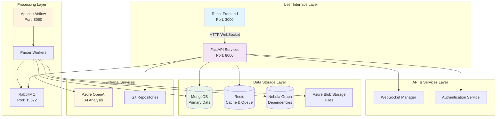

## 2. Component Architecture Detail

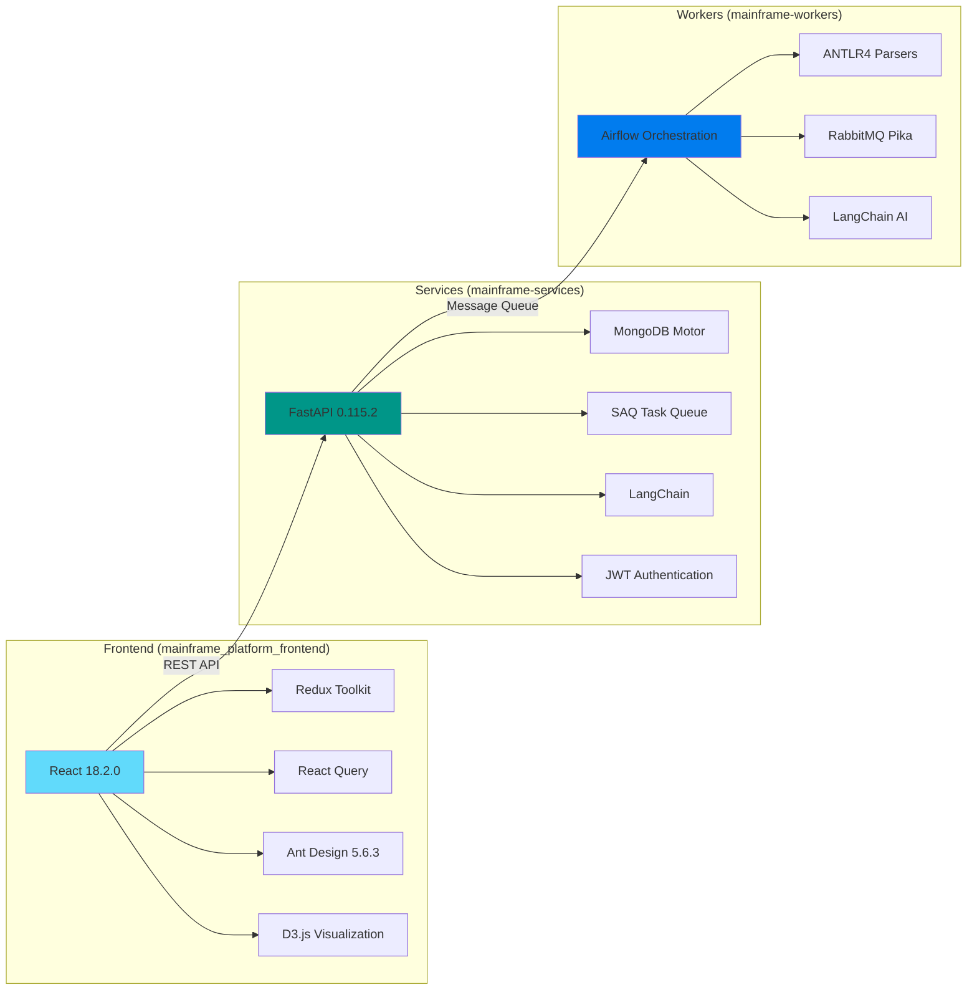

## 3. Data Flow Architecture

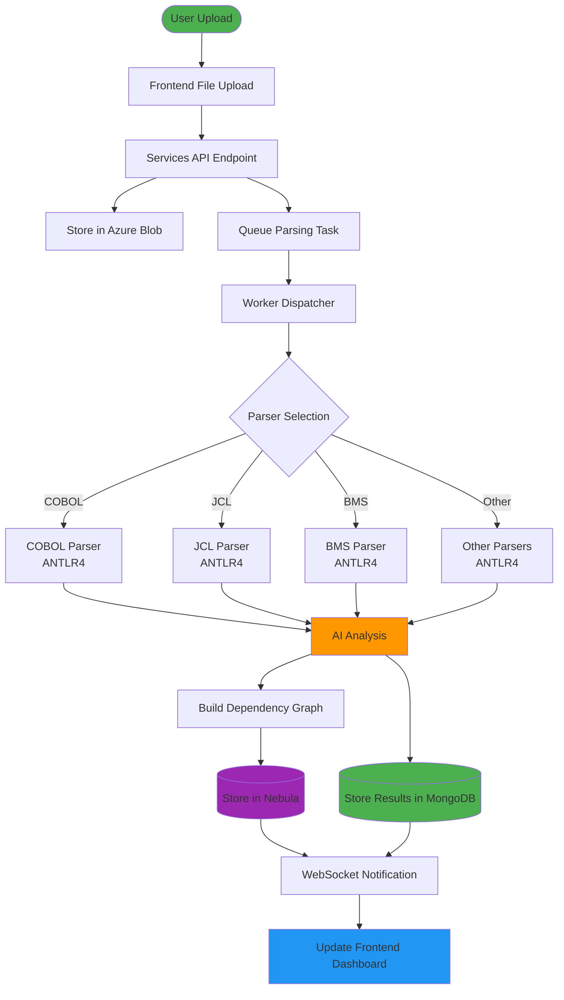

## 4. Parser Support Matrix

```mermaid
graph TB
    subgraph "COBOL Variants"
        IBM[IBM COBOL<br/>Cobol85.g4]
        UNISYS[Unisys COBOL<br/>CobolUnisys.g4]
        DNP[DNP COBOL<br/>DNP.g4]
        ISUZU[Isuzu COBOL<br/>CobolIsuzu.g4]
    end
    
    subgraph "Mainframe Languages"
        JCL[JCL<br/>IBM_JCL.g4]
        BMS[BMS<br/>BMS.g4]
        CLIST[CLIST<br/>Clist.g4]
        PANEL[Panel<br/>Panel.g4]
        WFL[WFL<br/>WFL.g4]
        LDLP[LDLP<br/>LDLP.g4]
    end
    
    subgraph "Supporting Formats"
        COPY[Copybooks<br/>CopyBook.g4]
        BATCH[Batch Scripts<br/>Batch.g4]
        OGL[OGL<br/>OGL.g4]
    end
    
    DISPATCHER[Parser Dispatcher] --> IBM
    DISPATCHER --> UNISYS
    DISPATCHER --> DNP
    DISPATCHER --> ISUZU
    DISPATCHER --> JCL
    DISPATCHER --> BMS
    DISPATCHER --> CLIST
    DISPATCHER --> PANEL
    DISPATCHER --> WFL
    DISPATCHER --> LDLP
    DISPATCHER --> COPY
    DISPATCHER --> BATCH
    DISPATCHER --> OGL
    
    style DISPATCHER fill:#ff6b6b
    style IBM fill:#4ecdc4
    style JCL fill:#45b7d1
    style COPY fill:#96ceb4
```

## 5. API Services Architecture

```mermaid
graph LR
    CLIENT[Client Applications] --> GATEWAY[API Gateway]
    
    GATEWAY --> AUTH[/auth<br/>Authentication]
    GATEWAY --> USERS[/users<br/>User Management]
    GATEWAY --> PROJECTS[/projects<br/>Project Lifecycle]
    GATEWAY --> REPOS[/repositories<br/>Repository Handling]
    GATEWAY --> ASSESS[/assessments<br/>Complexity Analysis]
    GATEWAY --> REVERSE[/reverse<br/>Reverse Engineering]
    GATEWAY --> CHAT[/chat<br/>AI Assistant]
    GATEWAY --> SUMMARY[/summarization<br/>Code Summary]
    GATEWAY --> MIGRATE[/migration<br/>Migration Tools]
    GATEWAY --> DEAD[/deadcode<br/>Dead Code Detection]
    GATEWAY --> DUP[/duplicate-files<br/>Duplicate Analysis]
    GATEWAY --> DATA[/datasets<br/>Dataset Management]
    GATEWAY --> UTIL[/utilities<br/>System Utilities]
    
    AUTH --> JWT[JWT Service]
    PROJECTS --> MONGO1[(MongoDB)]
    REPOS --> GIT[Git Integration]
    ASSESS --> AI1[AI Analysis]
    CHAT --> OPENAI[Azure OpenAI]
    
    style CLIENT fill:#e3f2fd
    style GATEWAY fill:#f3e5f5
    style CHAT fill:#fff3e0
    style OPENAI fill:#ffecb3
```

## 6. Message Queue Architecture

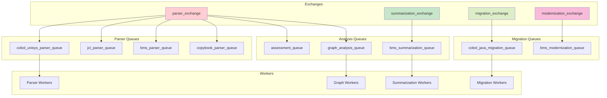

## 7. Data Storage Schema

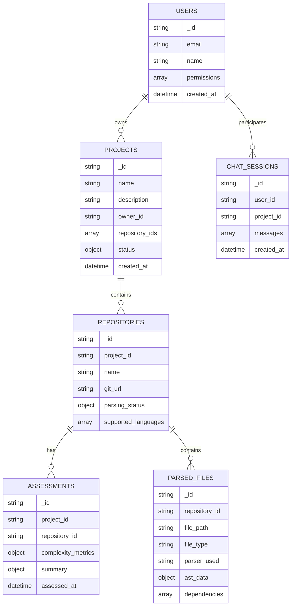

## 8. Security Architecture

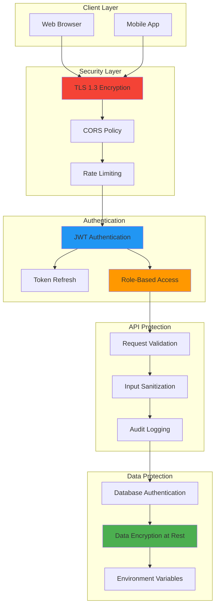

## 9. Deployment Architecture

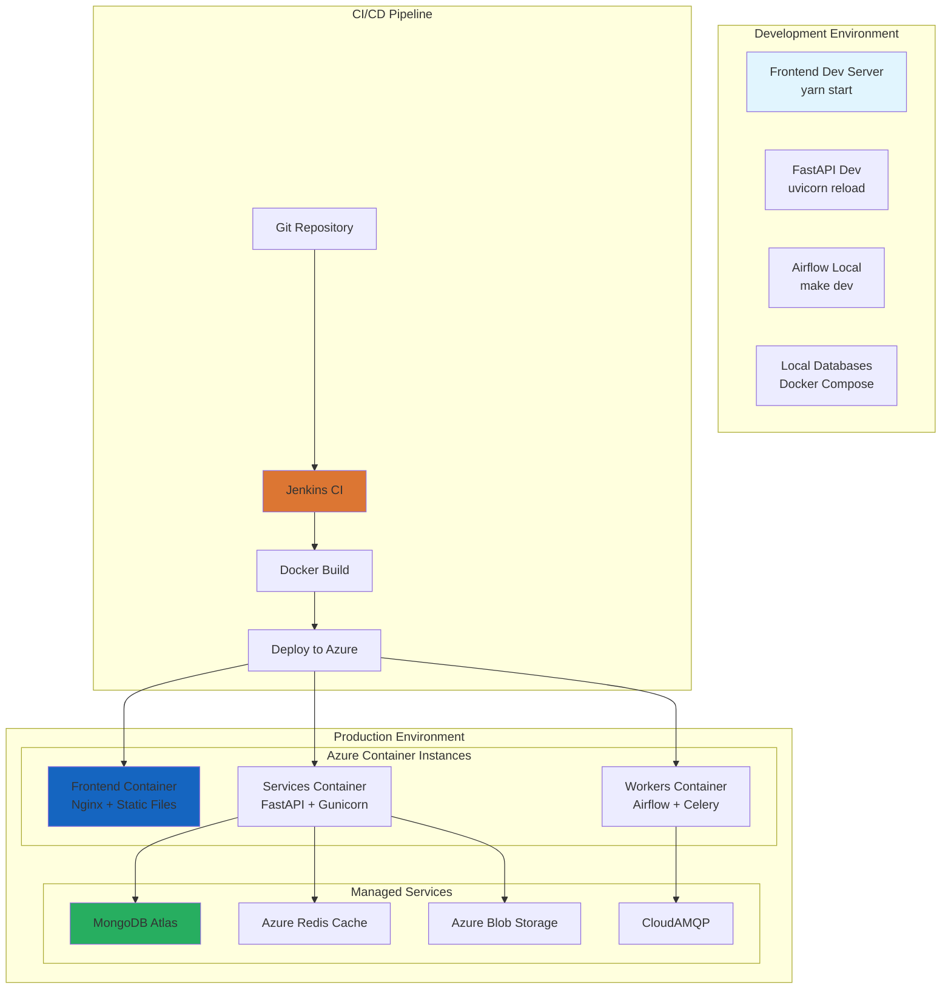

## 10. Processing Pipeline Flow

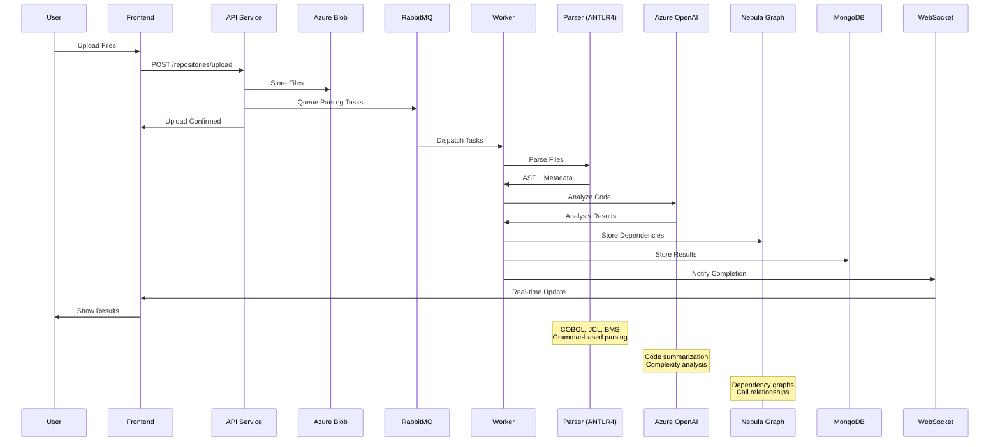

## 11. Technology Stack Overview

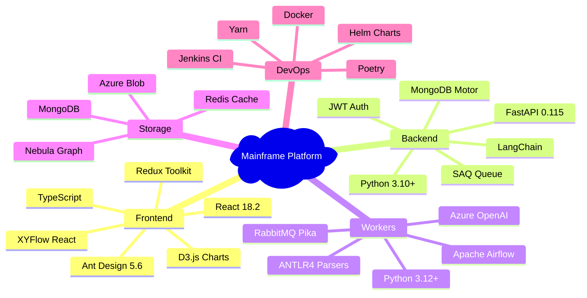

## 12. User Journey Flow

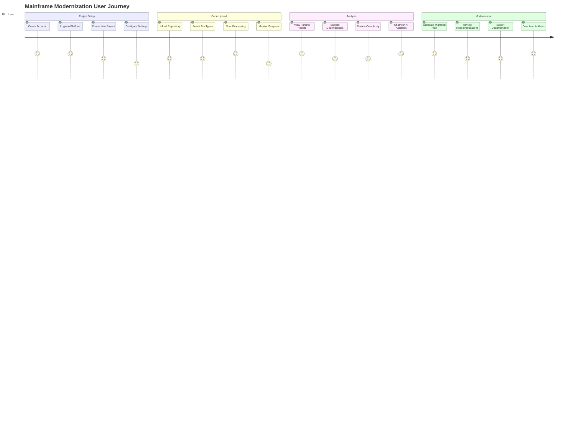

---

These Mermaid diagrams provide comprehensive visualization of your Mainframe Modernization Platform architecture, covering system components, data flows, deployment patterns, and user interactions. Each diagram can be rendered in any Mermaid-compatible viewer or documentation system.