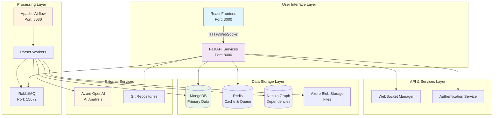
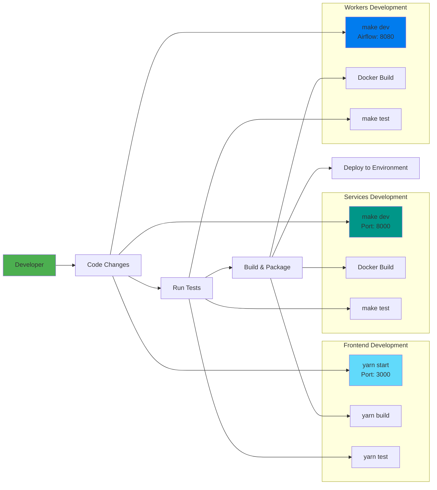

# Mainframe Platform

A comprehensive platform for mainframe modernization, analysis, and management with frontend, backend services, and worker components.

## 🏗️ Architecture

The platform consists of three main components:

- **Frontend** (`mainframe_platform_frontend/`) - React-based web interface
- **Services** (`mainframe-services/`) - FastAPI backend services
- **Workers** (`mainframe-workers/`) - Airflow-based data processing workers



## 🚀 Quick Start

### Prerequisites

- **Docker & Docker Compose** - For running services and workers
- **Node.js & Yarn** - For frontend development
- **Python 3.8+** - For backend services and workers
- **Poetry** - Python dependency management

### 1. Frontend Setup

```bash
cd mainframe_platform_frontend
yarn install
yarn start
```

The frontend will be available at `http://localhost:3000`

### 2. Backend Services Setup

```bash
cd mainframe-services
make install
make dev
```

This will:
- Install Python dependencies using Poetry
- Generate environment configuration
- Start the services stack using Docker Compose

Services will be available at `http://localhost:8000`

### 3. Workers Setup

```bash
cd mainframe-workers
make install
make dev
```

This will:
- Install Python dependencies using Poetry
- Setup RabbitMQ message queue
- Start Airflow development stack

Airflow UI will be available at `http://localhost:8080`

## 📋 Available Commands

### Frontend Commands

```bash
cd mainframe_platform_frontend
yarn start          # Start development server
yarn build          # Build for production
yarn test           # Run tests
yarn check:all      # Run linting and formatting checks
```

### Backend Services Commands

```bash
cd mainframe-services
make install        # Install dependencies and setup environment
make dev            # Start development stack
make dev-down       # Stop development stack
make dev-logs       # View development logs
make test           # Run tests
make clean          # Clean Python cache files
```

### Workers Commands

```bash
cd mainframe-workers
make install        # Install dependencies and setup RabbitMQ
make dev            # Start Airflow development stack
make dev-down       # Stop Airflow stack
make dev-logs       # View Airflow logs
make dev-restart    # Restart Airflow stack
make dev-status     # Show Airflow stack status
make test           # Run tests
make lint           # Run linting checks
make format         # Format code with black and isort
make clean          # Clean Python cache files
```

## 🔧 Development

### Environment Configuration

Each component has its own environment configuration:

- **Frontend**: Uses environment variables for API endpoints
- **Services**: Copy `env.dev.example` to `.env` for development
- **Workers**: Copy `env.example` to `.env` for development

### Running Individual Components

#### Services Only
```bash
cd mainframe-services
make dev-worker     # Start only the worker
make dev-worker-logs # View worker logs
make service-logs   # View service logs
```

#### Workers Only
```bash
cd mainframe-workers
make run            # Run worker directly (without Airflow)
```

## 🐳 Docker

All components can be run using Docker Compose:

### Development Stack
```bash
# Services
cd mainframe-services
docker-compose -f docker-compose.dev.yml up -d

# Workers
cd mainframe-workers
docker-compose -f docker-compose-airflow-dev.yaml up -d
```

### Production Stack
```bash
# Services
cd mainframe-services
docker-compose up -d

# Workers
cd mainframe-workers
docker-compose -f docker-compose-airflow.yaml up -d
```

## 📊 Monitoring

- **Frontend**: `http://localhost:3000`
- **Services API**: `http://localhost:8000`
- **Airflow UI**: `http://localhost:8080`
- **RabbitMQ Management**: `http://localhost:15672`

## 🧪 Testing

```bash
# Frontend tests
cd mainframe_platform_frontend
yarn test

# Backend tests
cd mainframe-services
make test

# Worker tests
cd mainframe-workers
make test
```

## 🧹 Cleanup

```bash
# Stop all development stacks
cd mainframe-services && make dev-down
cd mainframe-workers && make dev-down

# Clean Python cache
cd mainframe-services && make clean
cd mainframe-workers && make clean
```

## 📁 Project Structure

```
mainframe/
├── mainframe_platform_frontend/  # React frontend application
├── mainframe-services/           # FastAPI backend services
└── mainframe-workers/            # Airflow-based data processing workers
```

### Development Workflow



## 🤝 Contributing

1. Follow the existing code style and formatting
2. Run tests before submitting changes
3. Use the provided Makefile commands for development tasks

## 📝 License

[Add your license information here]
